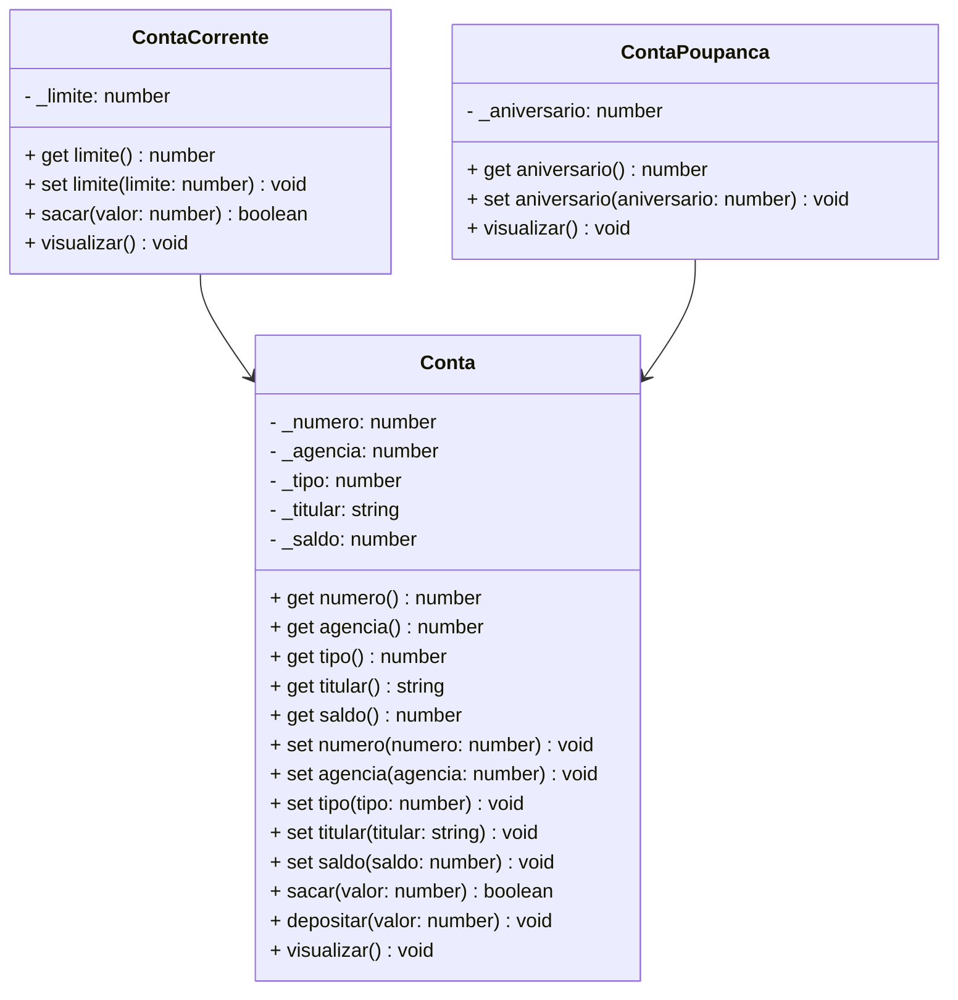

# Projeto Conta Bancária - TypeScript & POO

## Simulador de Sistema Bancário | Portfólio Profissional

<br />

<div align="center">
	
</div>
<br />

<div align="center">
  
  
  
  
  
  
  
</div>


------

<br />


O **Projeto Conta Bancária** é um projeto **educacional** desenvolvido em **TypeScript**, com foco em **Programação Orientada a Objetos (POO)** e **arquitetura modular**, simulando operações bancárias reais como **CRUD de contas, transferências, depósitos e saques**.

**Objetivo:** Demonstrar **organização, domínio técnico, modelagem de domínio e boas práticas de engenharia de software** em um case prático de portfólio.

<br />

> [!WARNING]
>
> Este projeto possui **fins educacionais** e **não representa um sistema bancário real**. Foi desenvolvido para **aprendizado, demonstração técnica e portfólio profissional**.

<br />

Este projeto foi estruturado para:

- Demonstrar **competência técnica em TypeScript**
- Aplicar **POO em um cenário realista**
- Evidenciar **arquitetura limpa e organização de código**
- Simular **regras de negócio financeiras**
- Servir como **case técnico para recrutadores**

<br />

## Competências Técnicas Demonstradas


- Programação Orientada a Objetos (Encapsulamento, Herança, Polimorfismo)
- Modelagem de domínio orientada a objetos
- Arquitetura em camadas (**Model, Repository, Controller**)
- Tipagem forte com **TypeScript**
- Separação de responsabilidades
- Boas práticas de código e organização modular
- Simulação de regras financeiras
- Validação de entradas e controle de fluxo
- Estrutura pronta para evolução futura (API, DB, testes)

<br />

## Impacto Técnico e Métricas


| Indicador                     | Valor                         |
| ----------------------------- | ----------------------------- |
| Linhas de código              | +600                          |
| Classes principais            | 3                             |
| Funcionalidades implementadas | 9                             |
| Conceitos POO aplicados       | 6+                            |
| Camadas arquiteturais         | Model, Repository, Controller |
| Persistência                  | Simulada em memória           |
| Complexidade lógica           | Média                         |
| Uso educacional               | ✅                             |

<br />

## Funcionalidades do Projeto


| Funcionalidade                  | Status |
| ------------------------------- | ------ |
| CRUD de contas bancárias        | ✅      |
| Conta Corrente e Conta Poupança | ✅      |
| Depósitos e Saques              | ✅      |
| Transferência entre contas      | ✅      |
| Consulta por número             | ✅      |
| Consulta por titular            | ✅      |
| Regras de saldo e limite        | ✅      |
| Interface CLI interativa        | ✅      |

<br />

### 🧭 Passo a Passo de Uso no Terminal

A aplicação interativa é operada através do console via comandos gerenciados pela classe customizada `Input`:

1. **Criar Conta (Opção 1):** Cadastre uma nova conta informando titular, número de agência, saldo inicial e selecione entre `1 - Conta Corrente` (com limite de crédito/cheque especial) ou `2 - Conta Poupança` (com dia de aniversário de 1 a 28).
2. **Listar Todas as Contas (Opção 2):** Exibe todas as contas em memória com seus respectivos saldos, limites e titulares.
3. **Buscar Conta por Número (Opção 3):** Localiza e imprime os detalhes de uma conta específica a partir do seu ID numérico.
4. **Atualizar Dados (Opção 4):** Permite alterar seletivamente os dados da conta. É possível manter qualquer dado original simplesmente pressionando `Enter`.
5. **Apagar Conta (Opção 5):** Exclusão segura com prévia dos dados e confirmação explícita (`Sim/Não`) antes da remoção definitiva.
6. **Sacar (Opção 6):** Realiza a retirada de valores. Em Contas Correntes, caso o valor exceda o saldo, o sistema utiliza automaticamente o limite de crédito disponível.
7. **Depositar (Opção 7):** Credita o valor na conta. Caso a conta esteja utilizando o limite de cheque especial, o depósito quita prioritariamente o limite utilizado antes de elevar o saldo.
8. **Transferir entre Contas (Opção 8):** Movimenta valores entre contas de origem e destino com validação de saldo e limite.
9. **Buscar por Titular (Opção 9):** Busca textual por nome do titular (insensível a maiúsculas/minúsculas).
10. **Sair (Opção 0):** Encerra a aplicação exibindo os créditos e links do desenvolvedor.

<br />

## 🎯 Diferenciais de Implementação

Além do CRUD padrão, o projeto implementa regras de negócio financeiras refinadas:
* **Gestão Inteligente de Cheque Especial:** No saque, se o saldo for insuficiente mas houver limite disponível, a operação é autorizada e o limite é debitado. No depósito, a recomposição do limite consumido tem prioridade absoluta antes de gerar saldo positivo.
* **Classe Utilitária de Terminal (`Input.ts`):** Tratamento multiplataforma de encoding para Windows (chaveamento automático para `chcp 65001` / UTF-8 e decodificação CP850), sanitização de inputs numéricos negativos (`Math.abs`) e suporte a campos opcionais com tecla `Enter`.

<br />

## Diagrama de Classes




<br />

## Arquitetura do Projeto


Estrutura organizada para facilitar **manutenção, escalabilidade e leitura técnica**:

```text
📦 conta_bancaria
 ┣ 📂 src
 ┃ ┣ 📂 controller     # Regras de aplicação (ContaController)
 ┃ ┣ 📂 model          # Entidades de domínio (Conta, ContaCorrente, ContaPoupanca)
 ┃ ┣ 📂 repository     # Contratos de persistência (ContaRepository)
 ┃ ┗ 📂 util           # Utilitários (Input, Cores)
 ┣ 📜 Menu.ts          # Ponto de entrada da aplicação
 ┗ 📜 tsconfig.json
```

<br />

## Tecnologias Utilizadas


- **Linguagem & Runtime**

  - TypeScript

  - Node.js

  - ts-node

- **Ferramentas & Qualidade**
  - Git & GitHub
  - Mermaid (diagramas UML)
  - CLI interativa (terminal com readline-sync)

<br />

## Como Executar


**1️⃣ Clone o repositório**

```bash
git clone https://github.com/erickystn/Projeto_Conta_Bancaria.git
```

**2️⃣ Acesse a pasta do projeto via terminal**

```bash
cd Projeto_Conta_Bancaria
```

**3️⃣ Instale as dependências**

```bash
npm install
```

**4️⃣ Execute a aplicação**

```bash
# Execução direta via ts-node:
ts-node Menu.ts

# Ou via npx (sem instalação global):
npx ts-node Menu.ts
```

<br />

## 💻 Exemplos de Uso e Código

### 1. Polimorfismo e Regras de Operações Bancárias
```typescript
import { ContaCorrente } from "./src/model/ContaCorrente";
import { ContaPoupanca } from "./src/model/ContaPoupanca";
import { ContaController } from "./src/controller/ContaController";

const contas = new ContaController();

// 1. Criação de Conta Corrente (saldo: R$ 500, limite: R$ 1.000)
const cc = new ContaCorrente(contas.gerarNumero(), 123, "Ericky Santana", 500.0, 1000.0);
contas.cadastrar(cc);

// 2. Saque utilizando saldo + parte do limite de cheque especial
cc.sacar(700.0); // Saldo fica 0 e o limite passa a ser consumido em R$ 200

// 3. Depósito recompondo o limite prioritariamente
cc.depositar(300.0); // R$ 200 quitam o limite e R$ 100 viram saldo positivo

// 4. Criação de Conta Poupança com data de rendimento
const cp = new ContaPoupanca(contas.gerarNumero(), 123, "Maria Silva", 2500.0, 15);
contas.cadastrar(cp);
```

### 2. Formatação de Dados no Terminal (`visualizar()`)
```text
***********************************************************
Dados da Conta:
***********************************************************
Numero da Conta: 1
Agência: 123
Tipo da Conta: Conta Corrente
Titular: Ericky Santana
Saldo: R$ 100.00
Limite de Crédito: R$ 1000.00
Limite Disponível: R$ 1000.00
```

<br />

## Implementações Futuras


- [ ]  Persistência com banco de dados
- [ ]  Testes automatizados (Jest)
- [ ]  API REST com NestJS
- [ ]  Interface Web (React)
- [ ]  Dockerização
- [ ]  CI/CD com GitHub Actions

<br />

## Contribuições


Sugestões, melhorias e pull requests são bem-vindos.

Você pode contribuir com:

- Melhorias arquiteturais
- Refatorações
- Testes automatizados
- Documentação

<br />

## Licença


Este projeto está sob licença **MIT** — livre para uso educacional e profissional.

<br />

##  Autor


**Ericky — Desenvolvedor Full Stack**

🔗 **GitHub:** https://github.com/erickystn

🔗 **LinkedIn:** https://www.linkedin.com/in/erickystn

Projeto desenvolvido para **aprendizado contínuo**, **demonstração técnica** e **portfólio profissional**.